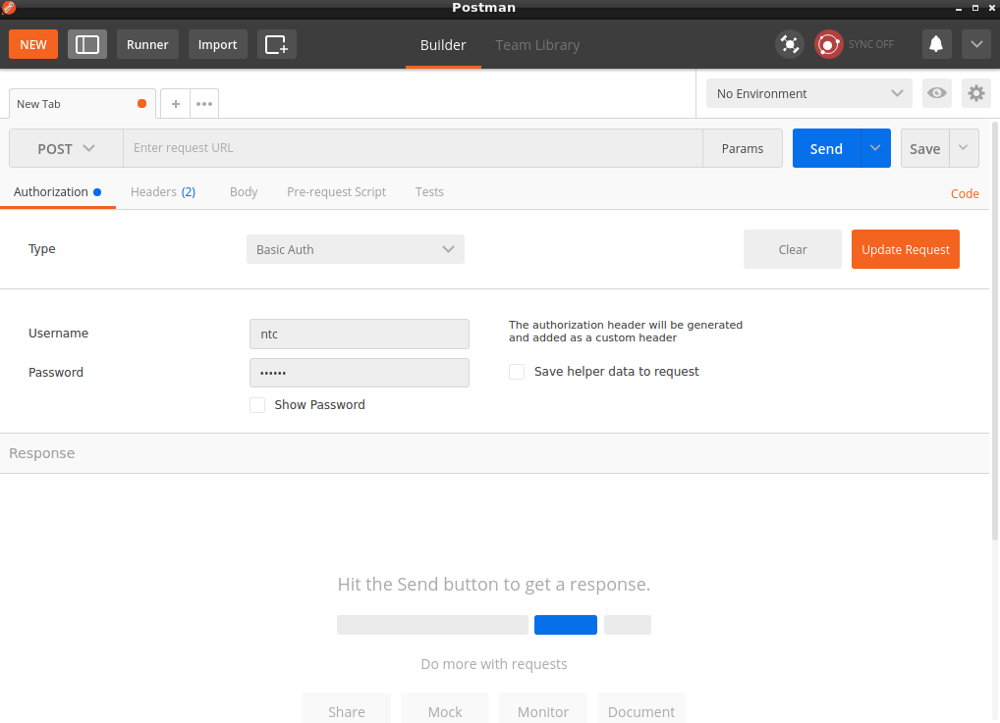
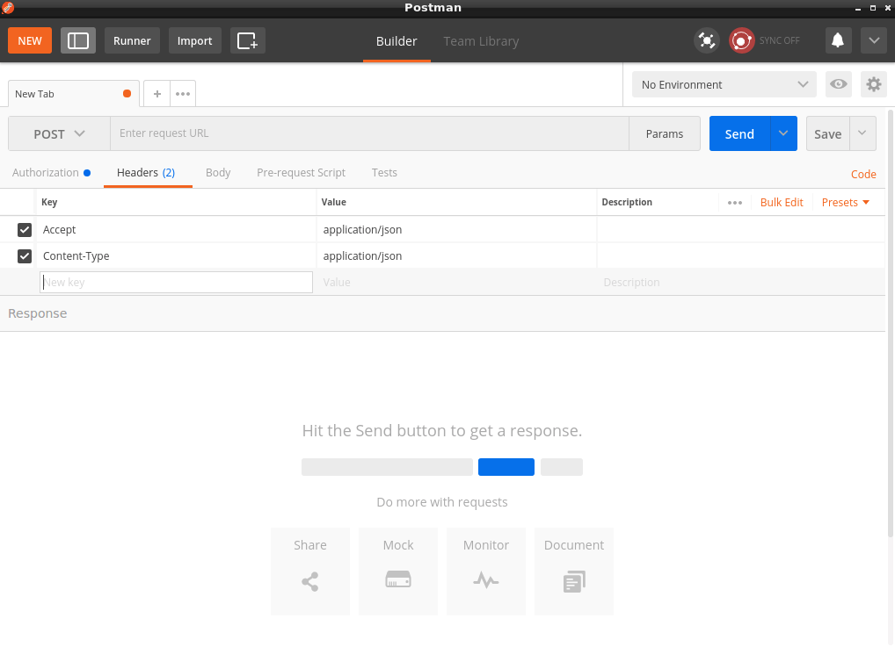
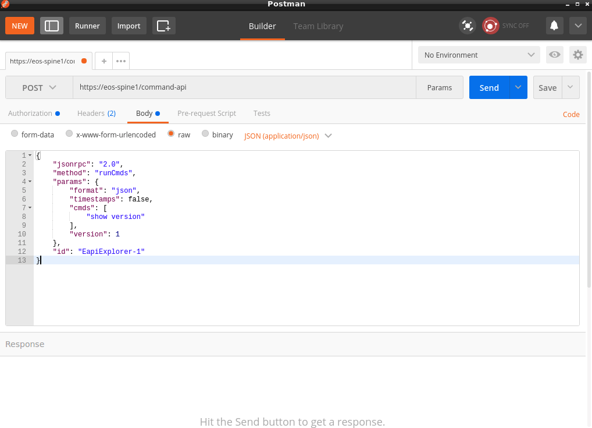
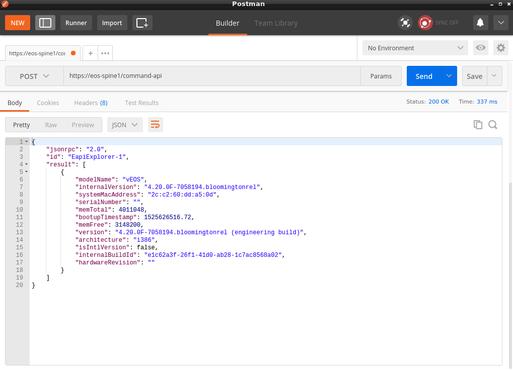
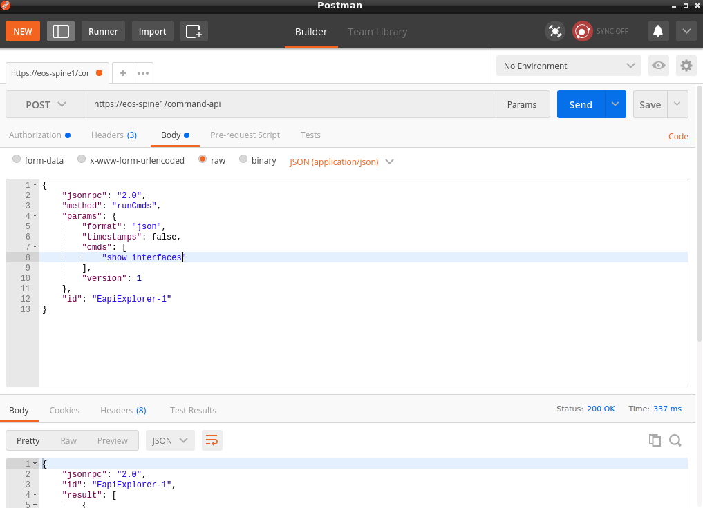
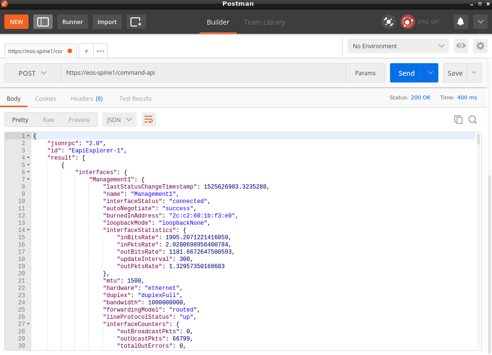
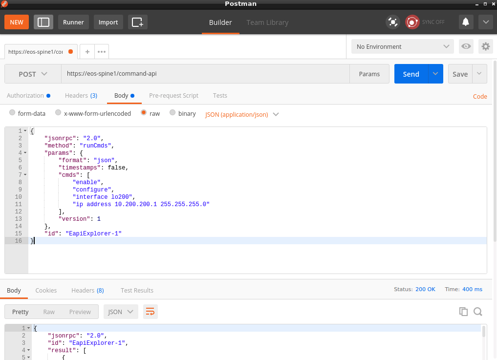
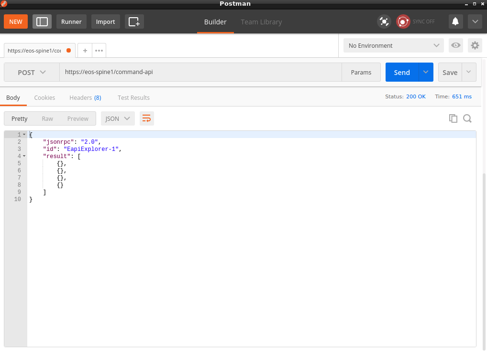
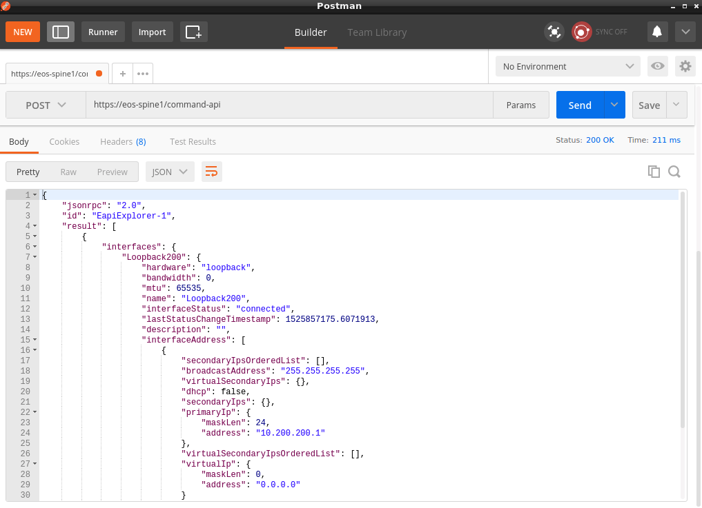

## Lab 23 - Exploring Arista eAPI with Postman

### Task 1 - Exploring Arista eAPI with Postman

This task will focus on issuing show commands with Postman.

Note: For these tasks, use the `eos-spine1` device.

##### Step 1

Remote Desktop into your Jump Host and open the Postman application on the Desktop.


##### Step 2

We are now going to construct our first HTTP Request to get configuration data from the EOS device.

First, set the HTTP request type to `POST`.


##### Step 3

In the Authorization tab, select `Basic Auth` for the **Type** and use "ntc" and "ntc123" as the username and password, respectively.



##### Step 4

In the Headers tab, add two header options:
  * `Accept`
  * `Content-Type`

Set both to `application/json`



##### Step 5

Add the following URL next to the POST drop down:

```
https://eos-spine1/command-api
```

##### Step 6

Move to the `Body` pane and paste the following content:

```
{
	"jsonrpc": "2.0",
	"method": "runCmds",
	"params": {
		"format": "json",
		"timestamps": false,
		"cmds": [
			"show version"
		],
		"version": 1
		},
	"id": "EapiExplorer-1"
}
```



##### Step 7

Click the **Send** button to make the HTTP request.

##### Step 8

If it fails, click the URL in the bottom pane.  You'll be prompted to accept the security risk of using a self-signed certificate.  You'll be prompted to also login - you can click cancel.  There is no need to login.  Once you get prompted to login, you can move to the next step.

##### Step 9

Re-click the **Send** button.

##### Step 10

You should see the JSON response in the bottom pane.

Scroll through the response object and take a deeper look.

Note that **Status** code is 200.  This is a standard HTTP Response code and tell us that everything worked.



##### Step 11

Change the command to `show interfaces` to get informations about available interfaces.



##### Step 12

Re-click the **Send** button.

##### Step 13

Scroll through the response object.




### Task 2: Making Configuration Changes

In this task we want to manage the configuration of a loopback interface.


##### Step 1

Modify the `cmds` field from the body by adding these commands:

- `enable`
- `configure`
- `interface lo200`
- `ip address 10.200.200.1 255.255.255.0`



##### Step 2

Click the **Send** button to make the HTTP request.




##### Step 3

Retrieve the Loopback configuration using the `show interfaces lo200` command:


##### Step 4

Click the **Send** button to make the HTTP request.


